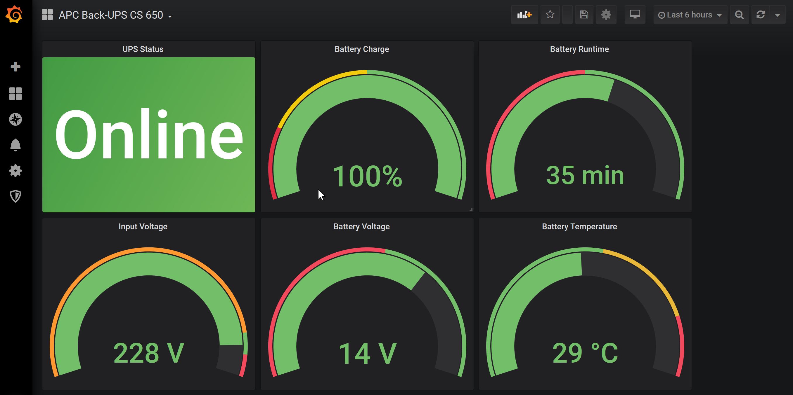
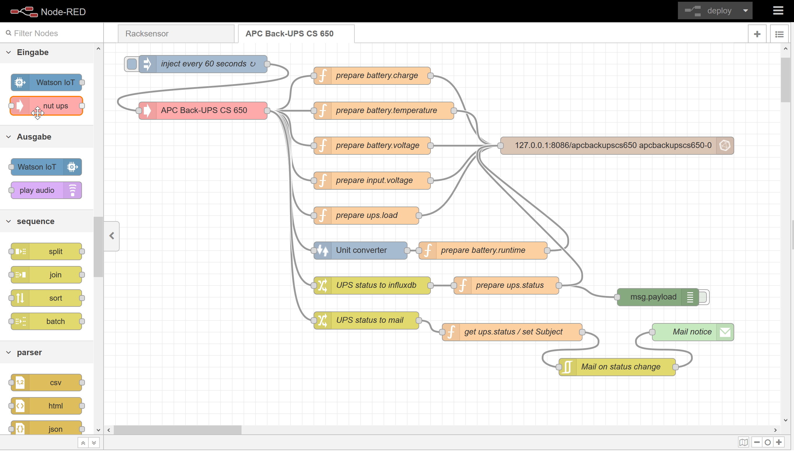
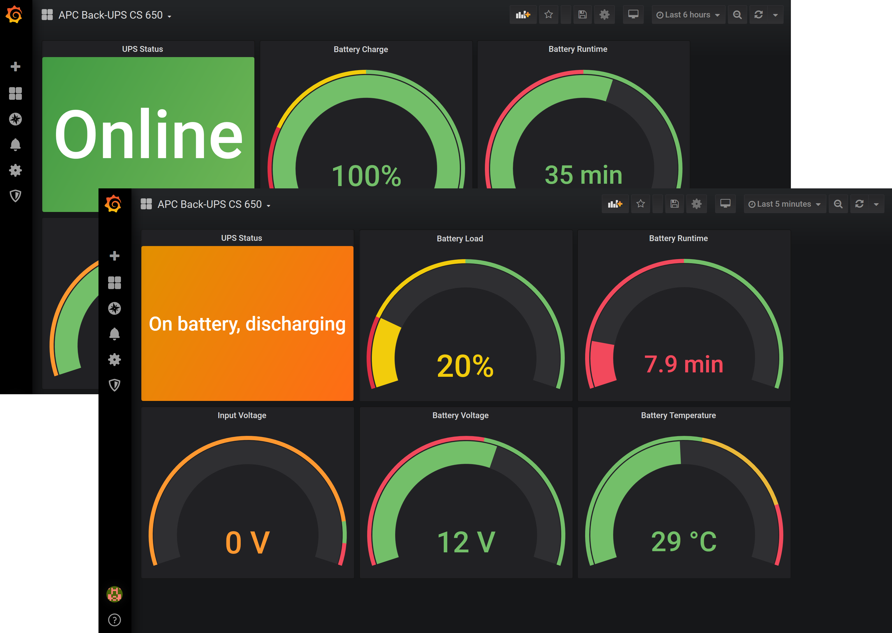

# UPSmonitor
This repo provides the code to set up the monitoring and alerting for an APC UPS with Network UPS Tools (NUT), Node-RED, InfluxDB and Grafana. It's just some example code, which comes "as-it-is" without any warranties or support. Please feel free to adapt it to suit your needs.



I have configured and tested the Node-RED flow and the Grafana dashboard with two APC UPS models, one "Back-UPS RS 900G" and an older "Back-UPS CS 650", both connected via USB to a Raspberry Pi 3 with Rasbian Buster Lite and NUT, Node-RED, InfluxDB and Grafana all locally installed.

## Prerequisites
Here I will provide some information about the prerequisites and how to setup NUT to get things rollin'.

## Node-RED flow
For the Node-RED flow I assume, that Node-RED and InfluxDB are locally installed on the system, the USV is connected to. Provided that Node-RED is already up and running, first install the appropriate node to connect to NUT as well as unit converter and mail nodes:
```sh
cd /home/pi/.node-red/node_modules
npm install node-red-contrib-nut-ups
npm install node-red-contrib-unit-converter
npm install node-red-node-email
npm audit fix
```
Then restart Node-RED...
```sh
sudo systemctl restart nodered.service
```
...and create an empty database for the USV's values:
```sh
sudo influx -execute 'CREATE DATABASE apcbackupscs650'
```
After that, open the Node-RED frontend to import [the flow](https://github.com/cknermann/UPSmonitor/blob/master/UPSmonitor_node-red_flow.json):



Adapt USV name, values, database connection and e-mail settings as needed.

## Grafana dashboard
Logon to Grafana, setup a connection to the database containing the USV's values. Import [the dashboard](https://github.com/cknermann/UPSmonitor/blob/master/UPSmonitor_grafana_dashboard.json), adapt USV name and values as needed. Enjoy the view:

