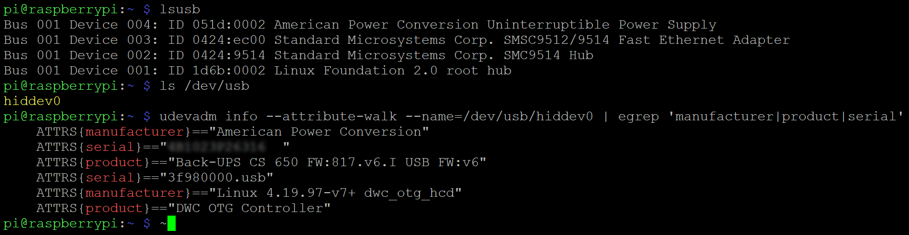

# UPSmonitor
This repo provides the code to set up the monitoring and alerting for an APC UPS with Network UPS Tools (NUT), Node-RED, InfluxDB and Grafana. It's just some example code, which comes "as-it-is" without any warranties or support. Please feel free to adapt it to suit your needs.


I have configured and tested the Node-RED flow and the Grafana dashboard with two APC UPS models, one "Back-UPS RS 900G" and an older "Back-UPS CS 650", both connected via USB to a Raspberry Pi 3 with Rasbian Buster Lite and NUT, Node-RED, InfluxDB and Grafana all locally installed.

## Prerequisites
Here is a quick walkthrough showing all the steps I took to setup NUT to get things rollin'. First of all, the commands…
```sh
lsusb
ls /dev/usb/
udevadm info --attribute-walk --name=/dev/usb/hiddev0 | egrep 'manufacturer|product|serial'
```
…will show, if your UPS is regonized. The first commands will reveal the vendor and product IDs of the UPS. In this case, the vendor ID is 051d and the product ID is 0000). The second command will show the USB device's name, in this case /dev/usb/hiddev0.



The USB device's name is needed for the third command, which also shows the serial number. With this information, there are two options to configure the UPS in /etc/nut/ups.conf (be sure to increase maxtretry from 0 to 3): 
```sh
(…)
maxretry = 3
	
[UPS01]
    driver = usbhid-ups
    port = auto
    desc = "Back-UPS CS 650"
    vendorid = "051d"
    productid = "0002"
```
or
```sh
(…)
maxretry = 3
	
[UPS01]
	driver = usbhid-ups
	port = auto
	desc = "Back-UPS CS 650"
	serial = <your serial here>
```
Then start the UPS driver…
```sh
sudo upsdrvctl start
```
…which should generate an output like:
```sh
Network UPS Tools - UPS driver controller 2.7.4
Network UPS Tools - Generic HID driver 0.41 (2.7.4)
USB communication driver 0.33
Using subdriver: APC HID 0.96
```
Change the last line of /etc/nut/nut.conf…
```sh
(…)
MODE=netserver
```
…and add the following lines at the end of /etc/nut/upsd.conf :
```sh
(…)
LISTEN 127.0.0.1 3493
LISTEN <IP-address of your server> 3493
```
Now let's configure the NUT-Server to auto-start and then start it:

```sh
sudo systemctl enable nut-server.service
sudo systemctl start nut-server.service
```
The NUT CLI should now show all available variables that your UPS exposes:
```sh
upsc UPS01@localhost
```
With this information, you are ready to proceed to Node-RED and Grafana.


## Node-RED flow
For the Node-RED flow I assume, that Node-RED and InfluxDB are locally installed on the system, the USV is connected to. Provided that Node-RED is already up and running, first install the appropriate node to connect to NUT as well as unit converter and mail nodes:
```sh
cd /home/pi/.node-red/node_modules
npm install node-red-contrib-nut-ups
npm install node-red-contrib-unit-converter
npm install node-red-node-email
npm audit fix
```
Then restart Node-RED...
```sh
sudo systemctl restart nodered.service
```
...and create an empty database for the USV's values:
```sh
sudo influx -execute 'CREATE DATABASE apcbackupscs650'
```
After that, open the Node-RED frontend to import [the flow](https://github.com/cknermann/UPSmonitor/blob/master/UPSmonitor_node-red_flow.json):


Adapt USV name, values, database connection and e-mail settings as needed.

## Grafana dashboard
Logon to Grafana, setup a connection to the database containing the USV's values. Import [the dashboard](https://github.com/cknermann/UPSmonitor/blob/master/UPSmonitor_grafana_dashboard.json), adapt USV name and values as needed. Enjoy the view:

